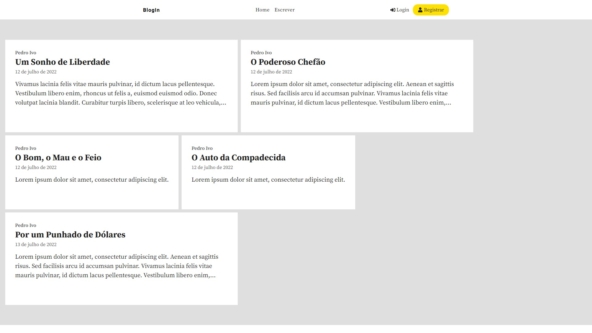
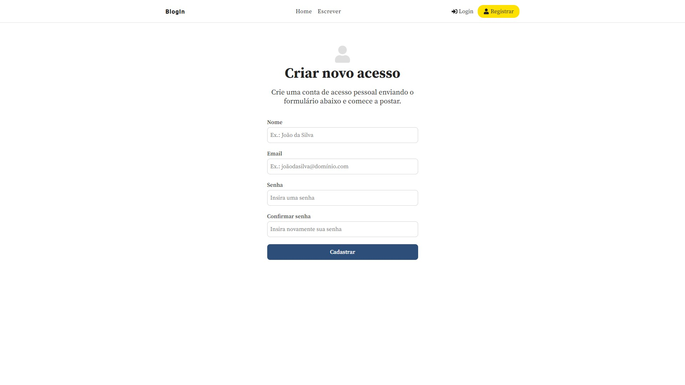
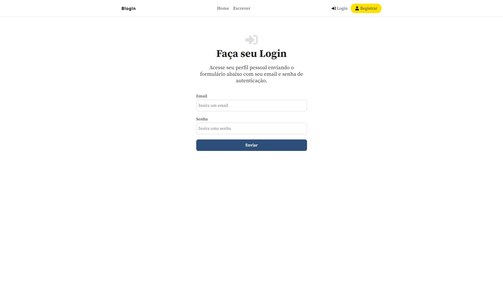
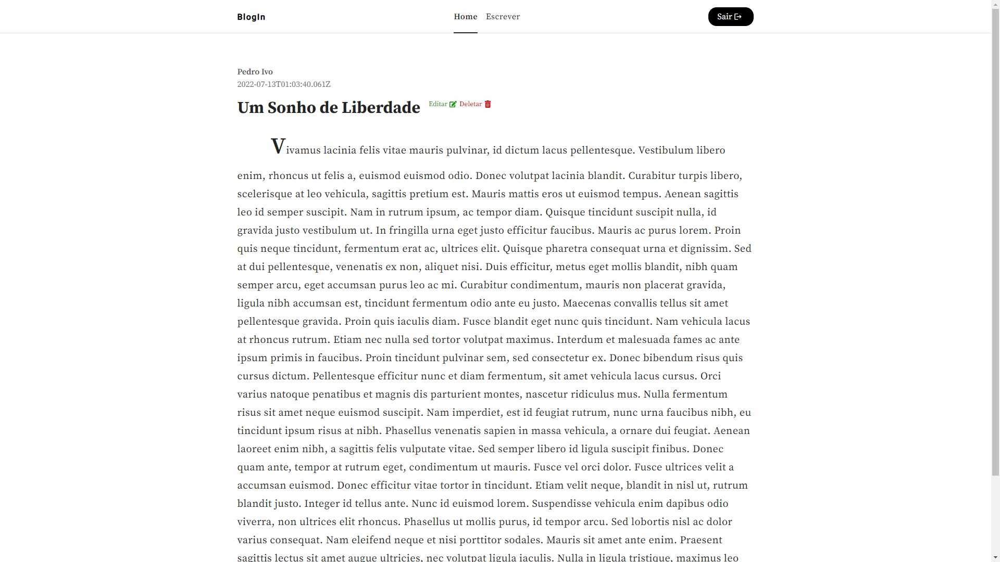
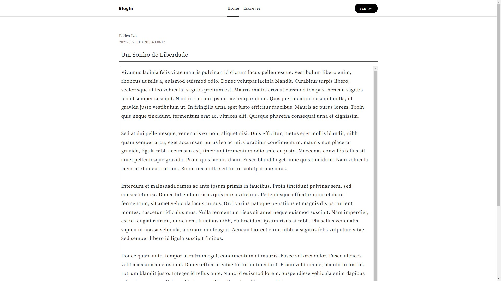
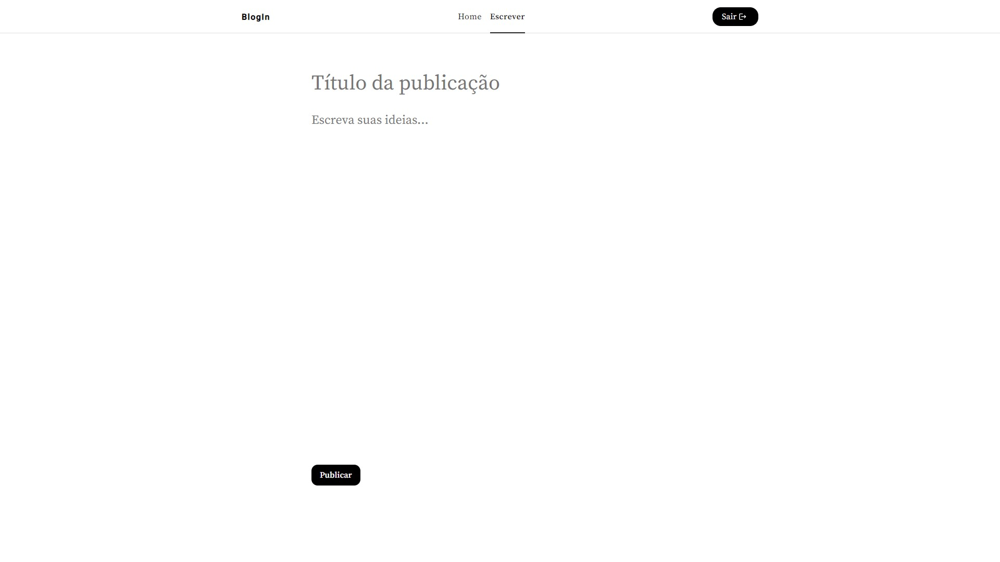

<!-- Title & Description -->
<h1 align="center">BlogIn</h1>

Plataforma para ler e criar publicações.

## Introdução

Este é um projeto de blog fullstack, em que desenvolvi o frontend com ReactJs e o backend com Node/Express e MongoDb.

Usuários novos podem criar registros, fazer login e logout. As rotas são protegidas com JWT, e as senhas são encriptadas com bcryptjs. No frontend, os estados referentes à autenticação são lidados com ContextAPI.

O usuário pode ler, escrever, editar e excluir publicações. Todas as publicações são acessíveis na Home (como um mural).

Fiz a estilização com SASS.

Utilizei React Toastify para gerar notificações ao usuário.

## Screenshots

- Tela inicial de visualização das publicações

- Tela inicial de visualização das publicações

- Tela inicial de visualização das publicações

- Tela inicial de visualização das publicações

- Tela inicial de visualização das publicações

- Tela inicial de visualização das publicações

## Pré-requisitos

Antes de começar, você vai precisar de [Git](https://git-scm.com), [Node.js](https://nodejs.org/en/) e um editor para o código, como [VSCode](https://code.visualstudio.com/).

## Tecnologias

As seguintes tecnologias foram usadas nos projeto:

- [NodeJS](https://nodejs.org/en/)
- [Express](https://expressjs.com/)
- [MongoDb Atlas](https://www.mongodb.com/atlas/database)
- [ReactJs](https://pt-br.reactjs.org/)

## Autor
**Pedro Ribas**  

## Licença

Este projeto está sob licença [MIT](LICENSE).

Feito com :heart: por <a href="https://github.com/pedroibribas" target="_blank">Pedro Ribas</a>.
