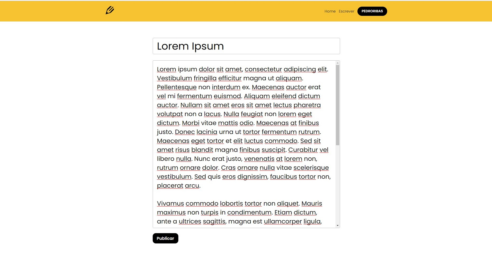
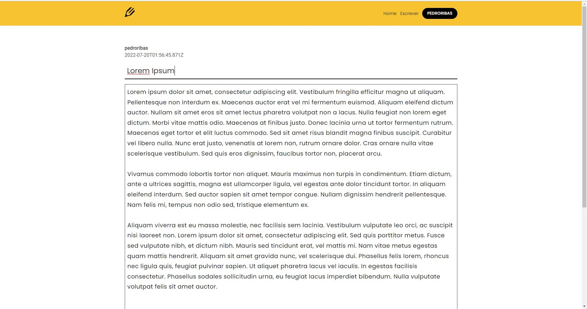

<!-- Title & Description -->
<h1 align="center">BlogIn</h1>
<p align="center">Projeto MERN fullstack de plataforma "blog".</p>

<br />

# Introdução

Este é um projeto fullstack de uma plataforma de blog para a leitura e criação de publicações. Nele, o usuário pode criar uma conta de acesso pessoal para compartilhar publicações com os demais usuários.


<small style="display: block">Tela inicial do projeto para desktop</small>
<br/>

## Frontend

O frontend é desenvolvido com ReactJS e NPM.

**Dependências:**

- SASS: extensão ao CSS;
- React Icons: biblioteca de ícones para ReactJS;
- Toastify: biblioteca para gerar notificações ao usuário;
- Axios: biblioteca para consumo da API; e,
- React Router DOM: biblioteca para roteamento para ReactJS.

**Responsividade:** A plataforma apresenta responsividade para desktop e mobile.


<small style="display: block">Tela inicial e tela de perfil para mobile</small>

## Backend

O servidor e a API REST foram desenvolvidos com Node/Express e NPM.

A database utilizada foi a MongoDB Atlas.

O deploy foi feito na plataforma Heroku.

**Dependências:**

- Dotenv: carregamento de variáveis de ambiente;
- Colors: estilização dos retornos no console;
- Cors: middleware Express para habilitar o CORS no projeto;
- Mongoose: ferramenta para lidar com a database MongoDB;
- Express Async Handler: middleware para tratamento de erros de funções assíncronas para Express;
- Json Web Token: gerenciamento de tokens para autenticação do usuário;
- Bcryptjs: criptografia para a senha do usuário;
- Nodemon: ferramenta para inicialização do backend; e,.
- Concurrently: ferramenta para inicialização do backend e frontend simultaneamente.

<br/>

# Funcionalidades

### Registro, login e logout de usuário

O usuário pode criar uma conta pessoal de acesso na tela de registro, e depois fazer seu login.

<small>Nota: no frontend, os estados referentes à autenticação são lidados com ContextAPI.</small>


<br/>

Uma vez logado, o usuário pode acessar o menu que lhe dá acesso ao perfil, a configurações do perfil e fazer o logout.


<br/>
<br/>

### Configurações de usuário

Em configurações do perfil, o usuário pode alterar sua senha.

<small>Nota: por enquanto o botão para excluir conta está desativado.</small>


<br />
<br />

### Criar, ler, editar e excluir publicações

O usuário pode ler qualquer publicação. Quando acessa uma publicação própria, as opções para editar e excluir aparecem.

<small>Nota: por enquanto não existe notificação para confirmar a exclusão, portanto o simples clique em excluir deletará a publicação.</small>


<br />

O usuário também tem acesso às informações e publicações de um usuário específico na tela de perfil respectiva. Quando estiver em seu próprio perfil, a opção de edição aparece.


<br />

O usuário, então, pode escrever, editar e excluir suas próprias publicações.






<bg />

Na homepage, é possível ler e acessar as seis últimas publicações de todos os usuários da plataforma.


<br/>
<br/>

## Pré-requisitos

Antes de começar, você vai precisar de [Git](https://git-scm.com), [Node.js](https://nodejs.org/en/) e um editor para o código, como [VSCode](https://code.visualstudio.com/).

## Inicialização

```bash
# Clone o repositório com HTTPS
$ gh repo clone pedroibribas/blogproject

# Acesse a pasta do projeto
$ cd blogproject

# Instale todas as dependências
$ npm install

# Execute o servidor
$ npm run server

# Execute o frontend
$ npm run client

# Execute backend e frontend concomitantemente
$ npm run dev

# O servidor será inicializado em <http://localhost:5000>

# O frontend será inicializado em <http://localhost:3000>
```

## Autor

**Pedro Ribas**
<a href="https://linkedin.com/in/pedroibribas/" target="_blank">

</a>
<a href="https://instagram.com/pedroivo.ribas/" target="_blank">

</a>

## Licença

Este projeto está sob licença [MIT](LICENSE).

Feito por <a href="https://github.com/pedroibribas" target="_blank">Pedro Ribas</a>.
